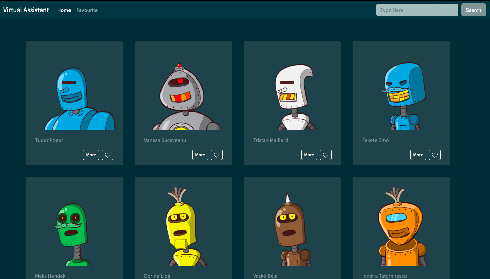

# Finding Virtual Assistant

Finding Virtual Assistant is a web application that allows users to search for virtual assistants, read assistant details, and add/remove them to/from their favorite list.

## Demo

https://annniewann.github.io/finding-virtual-assistant/

## Features

The following features are currently available on the website:

- A search functionality that allows users to search for virtual assistants
- Detailed profiles for each virtual assistant, including their gender, age, region and email
- The ability to add a virtual assistant to the user's favorite list.
- The ability to remove a virtual assistant from the user's favorite list.
- The ability to view the user's favorite list.

## Technologies

The website was built using the following technologies:

- HTML
- CSS
- JavaScript
- [Bootstrap](https://getbootstrap.com/)
- Fake user list Api
- axios

## Installation

The website is hosted on GitHub Pages and can be accessed at https://annniewann.github.io/finding-virtual-assistant/. No installation is required.

If you want to clone the repository and run the website locally, follow these steps:

1. Clone the repository: `git clone https://github.com/AnnnieWann/finding-virtual-assistant.git`
2. Navigate to the project directory: `cd finding-virtual-assistant`
3. Open `index.html` in your web browser.
